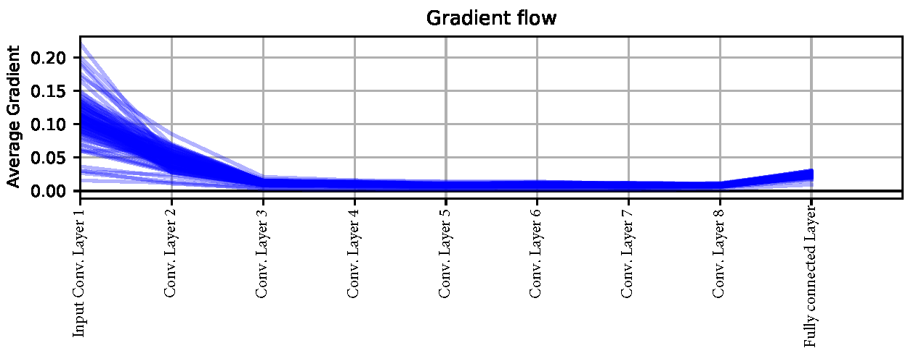
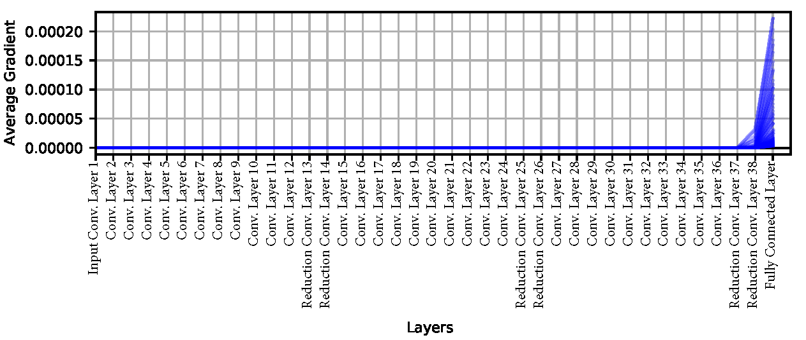
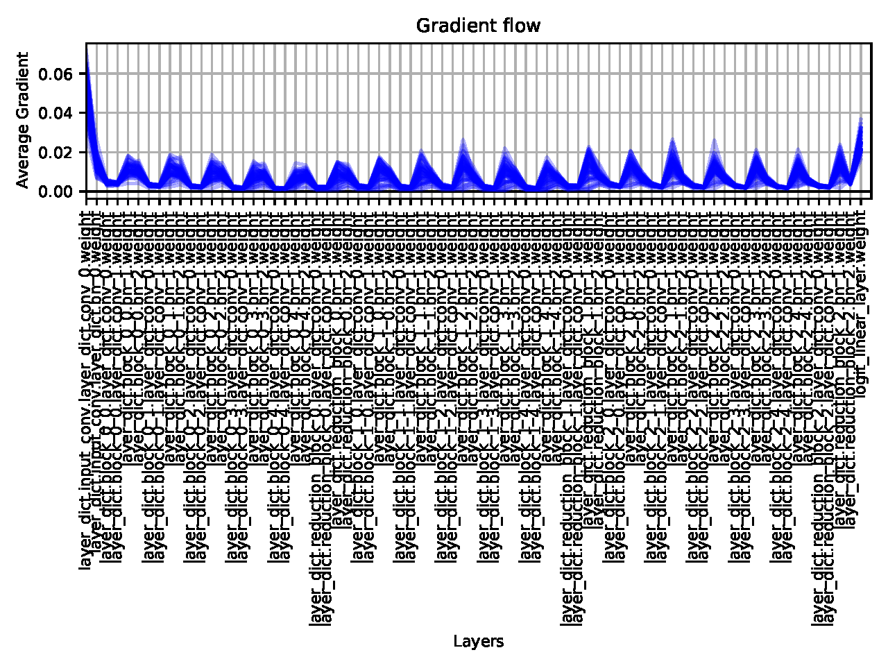
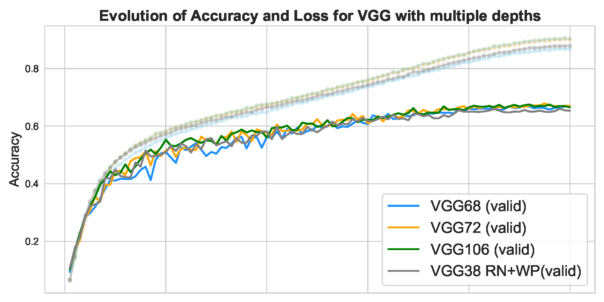
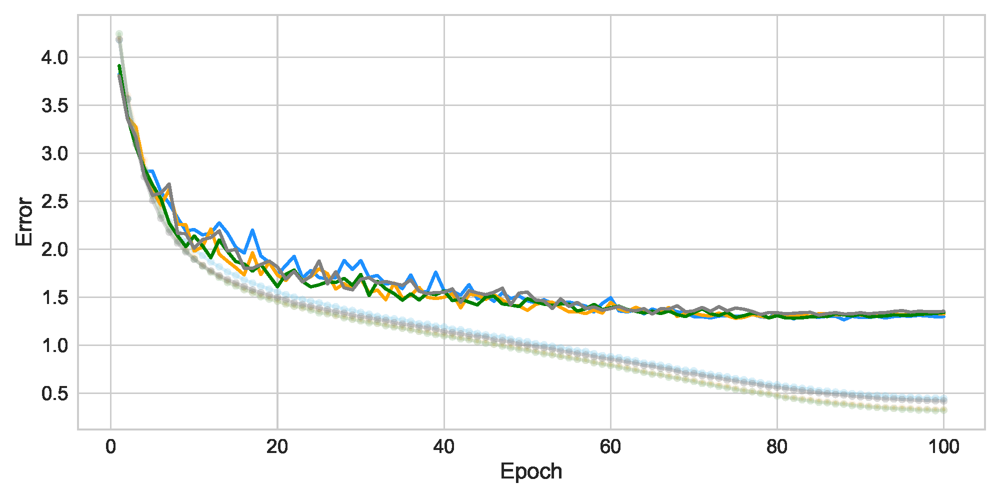

# Optimizing Convolutional Neural Networks with Residual Blocks and Batch Normalization
During this study we will identify what causes the vanishing/exploding gradient problem present in deep Convolutional Neural Networks by comparing the learning performance of two VGG architectures trained on the CIFAR-100 datset, one shallow (8 convolutional layers), and one deep (38 convolutional layer). We then move on to explore 3 possible solutions present in the literature. From these solutions we choose to implement Deep Residual Networks on the VGG architecture, and test the solution under multiple hyperparameter scenarios. We finally train the best VGG ResNet architecture on increasing depths, and find that a 68 layered network provides the best performance yielding a test accuracy of 65.83 %. The full report can be found [here](https://github.com/federicoarenasl/Optmizing-CNNs-w-ResNets/blob/main/ResNets_on_VGG_Architecture%20_for_CIFAR100.pdf)

## The CIFAR100 Dataset
We now focus on extensively testing the effcacy of our solution for multiple hyperparameter scenarios. To do this, we will train, validate and test the ability of our VGG architecture to learn to recognize images from the benchmark dataset CIFAR-100 [(Krizhevsky, 2009)](https://www.cs.toronto.edu/~kriz/learning-features-2009-TR.pdf). In total, the dataset contains 100 classes to recognize, and there are 600 32x32 RGB images per class, amounting to 60000 images. In our case, we use 47500 images for training, 2500 images for validation, and 10000 images for testing.

## The MLP machine learning framework
For constructing our Neural Network architectures we use the MLP ML Framework, since this study was done within the context of the Machine Learning Practical Course at the University of Edinburgh. The framework is not made available due to school licensing purposes.

## Structure of the post
  - [ResNets_on_VGG_Architecture_for_CIFAR100.pdf]((https://github.com/federicoarenasl/Optmizing-CNNs-w-ResNets/blob/main/ResNets_on_VGG_Architecture%20_for_CIFAR100.pdf)): This file represents the main file of the post, and we strongly encourage the reader to start by giving it a quick read to understand the project better. If the reader is still curios as to _how_ the results in the study were obtained, we encourage the reader to checkout the next two files.
  - ResNet-VGG0-on-CIFAR100.md : this file, accompanied by its ```.ipynb``` version in the ```Notebooks``` folder, will walk the reader through the bulding of the the building of the CNN blocks with residual connections and batch normalization. It will also walk the reader through the visualization of the results from all experiments done to search the hyperparameter space to reach the best model.
 
 ## A sneak peak at some results
We first train a shallow VGG model of 8 layers without residual connections nor batch normalization, and check how the gradient flow behaves through the network. Since the network is indeed shallow, it will not present the vanishing/exploding gradient. The gradient flow for this network is shown in the following plot.

<p align="center">

</p>

However, once we increase the model size to 38 layers, a clear sign of vanishing gradient is found, as shown below.

<p align="center">

</p>

We then modify our VGG archtecture to include skip connections between convolutional layers, and we apply batch normalization to the output of each convolutional layer, which control the gradient flow and prevent it from vanishin or exploding. The gradient flow for the ResNet VGG38 network with Batch Normalization is shown below.

<p align="center">

</p>

With this final architecture we perform a hyperparameter search to test the efficacy of the implemented solution, we go as far as training deeper models, and all of them continue learning, as shown below.

<p align="center">

</p>

<p align="center">

</p>
