# ResNet and Batch Normalization implementation on VGG CNN Architecture
On this notebook I look into the code of the convolutional blocks used in the VGG architecture, and how the skip connection and batch normalization is added to alleviate the problem of vanishing/exploding gradient. First, we will give a brief sneak peak into the code for implementing skip connections and batch normalization in the basic block of a VGG architecture, and then we will visualize all the results from all the experiments intended to test the efficacy of the solution.

## Implementing ResNets and Batch normalization in the basic block of VGG
The first part of this paper focuses on identifying and understanding how this problem appears on a deep CNN Network with a VGG architecture. The VGG architecture is composed of $S_k$ stages that contain $n_{cb}$ convolutional blocks. Each block is composed of two "same" convolutional operations, each followed by a ReLu activation function. After each stage, a pooling operation is performed on its output feature maps. These blocks are added together to form a complete VGG architecture. If we want to reduce the dimensionality of the feature maps, there is another type of block, the dimensionality reduction block, which performs a pooling operation and halves the size of the previous feature map.

### Regular Convolutional Processing Block
Inside the mlp framework, I use the nn.Module PyTorch method to define the convolutional block. I initialize it as follows:


```python
class ResNet_ConvolutionalProcessingBlock(nn.Module):
    def __init__(self, input_shape, num_filters, kernel_size, padding, bias, dilation):
        super(ResNet_ConvolutionalProcessingBlock, self).__init__()

        self.num_filters = num_filters
        self.kernel_size = kernel_size
        self.input_shape = input_shape
        self.padding = padding
        self.bias = bias
        self.dilation = dilation

        self.build_module()

```

I then build the architecture and perform batch normalization on the feature map from the 1st convolutional "same" operation. This is stored as ```self.bn_1``` and is passed to the followin convolutional "same" operation, which is also normalized and saved as ```self.bn_2```. Notice that during the model builder I don't apply the skip connection, since this is done during training, during the ```forward``` operation. As you can see, the ```forward``` method stores the initial feature map as ```identity```, which is then added to ```out``` at the end. This represents the skipped connection.


```python
    def build_module(self):
        self.layer_dict = nn.ModuleDict()
        x = torch.zeros(self.input_shape)
        out = x

        self.layer_dict['conv_0'] = nn.Conv2d(in_channels=out.shape[1], out_channels=self.num_filters, bias=self.bias,
                                              kernel_size=self.kernel_size, dilation=self.dilation,
                                              padding=self.padding, stride=1)

        out = self.layer_dict['conv_0'].forward(out)
        self.bn_1 = nn.BatchNorm2d(out.shape[1])
        out = self.bn_1(out)
        out = F.leaky_relu(out)

        self.layer_dict['conv_1'] = nn.Conv2d(in_channels=out.shape[1], out_channels=self.num_filters, bias=self.bias,
                                              kernel_size=self.kernel_size, dilation=self.dilation,
                                              padding=self.padding, stride=1)

        out = self.layer_dict['conv_1'].forward(out)
        self.bn_2 = nn.BatchNorm2d(out.shape[1])
        out = self.bn_2(out)
        out = F.leaky_relu(out)

        print(out.shape)

    def forward(self, x):
        out = x
        identity = x

        out = self.layer_dict['conv_0'].forward(out)
        out = self.bn_1(out)
        out = F.leaky_relu(out)

        out = self.layer_dict['conv_1'].forward(out)
        out = self.bn_2(out)
        out += identity
        out = F.leaky_relu(out)

        return out

```

### Convolutional Dimensionality Reduction Block
For the dimensionality reduction block, I use the same kind of initialization, and buildup of the model. However, during the forward pass, average pooling has to be applied to the ```identity``` feature map before adding it to the las feature map ```out``` of the convolutional block.


```python
class ResNet_ConvolutionalDimensionalityReductionBlock(nn.Module):
    def __init__(self, input_shape, num_filters, kernel_size, padding, bias, dilation, reduction_factor):
        super(ResNet_ConvolutionalDimensionalityReductionBlock, self).__init__()

        self.num_filters = num_filters
        self.kernel_size = kernel_size
        self.input_shape = input_shape
        self.padding = padding
        self.bias = bias
        self.dilation = dilation
        self.reduction_factor = reduction_factor
        self.build_module()

    def build_module(self):
        self.layer_dict = nn.ModuleDict()
        x = torch.zeros(self.input_shape)
        out = x

        self.layer_dict['conv_0'] = nn.Conv2d(in_channels=out.shape[1], out_channels=self.num_filters, bias=self.bias,
                                              kernel_size=self.kernel_size, dilation=self.dilation,
                                              padding=self.padding, stride=1)

        out = self.layer_dict['conv_0'].forward(out)
        self.bn_1 = nn.BatchNorm2d(out.shape[1])
        out = self.bn_1(out)
        out = F.leaky_relu(out)

        out = F.avg_pool2d(out, self.reduction_factor)

        self.layer_dict['conv_1'] = nn.Conv2d(in_channels=out.shape[1], out_channels=self.num_filters, bias=self.bias,
                                              kernel_size=self.kernel_size, dilation=self.dilation,
                                              padding=self.padding, stride=1)

        out = self.layer_dict['conv_1'].forward(out)
        self.bn_2 = nn.BatchNorm2d(out.shape[1])
        out = self.bn_2(out)
        out = F.leaky_relu(out)

        print(out.shape)

    def forward(self, x):
        out = x
        identity = x

        out = self.layer_dict['conv_0'].forward(out)
        out = self.bn_1(out)
        out = F.leaky_relu(out)

        out = F.avg_pool2d(out, self.reduction_factor)

        out = self.layer_dict['conv_1'].forward(out)
        out = self.bn_2(out)
        out += F.avg_pool2d(identity, self.reduction_factor)
        out = F.leaky_relu(out)

        return out

```

## Testing the efficacy of the solution on CIFAR100 with multiple hyperparameter variations
We now move on to testing the efficacy of the solution by visualizing the results of multiple iterations of the model with different hyperparameters. We do this in order to check the boundaries of the solution and its efficacy under different circumstances.

We start by importing the libraries we'll use to visualize the results from the experiments


```python
import os
import sys
import matplotlib
import matplotlib.pyplot as plt
import numpy as np
import pandas as pd
import seaborn as sns
%matplotlib inline
sns.set_style("whitegrid")
```

## Helper functions definition
And move on to defining helper functions that will allow us to go through the experiments results which more ease.


```python
def size_fixer(df_dict, n_epochs):
    for key in df_dict.keys():
        df_dict[key] = df_dict[key].iloc[:n_epochs,:]
    
    return df_dict

def collect_experiment_dicts(target_dir, test_flag=False):
    experiment_dicts = dict()
    for subdir, dir, files in os.walk(target_dir):
        for file in files:
            filepath = None
            if not test_flag:
                if file == 'summary.csv':
                    filepath = os.path.join(subdir, file)
            
            elif test_flag:
                if file == 'test_summary.csv':
                    filepath = os.path.join(subdir, file)
            
            if filepath is not None:
                
                with open(filepath, 'r') as read_file:
                    lines = read_file.readlines()
                
                pd_file = pd.read_csv(filepath)
                    
                current_experiment_dict = {key: [] for key in lines[0].replace('\n', '').split(',')}
                idx_to_key = {idx: key for idx, key in enumerate(lines[0].replace('\n', '').split(','))}
                
                for line in lines[1:]:
                    for idx, value in enumerate(line.replace('\n', '').split(',')):
                        current_experiment_dict[idx_to_key[idx]].append(float(value))
                
                experiment_dicts[subdir.split('/')[-2]] = pd_file
    
    print("Data files:", list(experiment_dicts.keys()))
                
    return experiment_dicts
```

## Experiment visualization
We perform 5 sets of experiments designed to test differen aspects of the solution. See [the full report](https://github.com/federicoarenasl/Optmizing-CNNs-w-ResNets/blob/main/ResNets_on_VGG_Architecture_for_CIFAR100.pdf) for more details.

## Experiment Set 1 -  Testing if problem is solved + Sigmoid function 


```python
# Collect Results DataFrames
experiment_dir = '../Remote_Experiments/Experiment_Set_1/'
df_result_dict = size_fixer(collect_experiment_dicts(target_dir=experiment_dir), 100)
baseline_ResNet = df_result_dict['VGG_38_ResNet_experiment_']

# Show last results
for experiment in df_result_dict.keys():
    print("\nExperiment:", experiment)
    print(df_result_dict[experiment].tail(1))
```

    Data files: ['VGG_08', 'VGG_38_BN_experiment', 'VGG_38_ResNet_experiment_', 'VGG_38', 'VGG_38_ResNet_sigmoid']
    
    Experiment: VGG_08
        train_acc  train_loss  val_acc  val_loss
    99   0.551684    1.604334    0.486  1.964776
    
    Experiment: VGG_38_BN_experiment
        train_acc  train_loss  val_acc  val_loss
    99   0.544295    1.611708   0.4508   2.01234
    
    Experiment: VGG_38_ResNet_experiment_
        train_acc  train_loss  val_acc  val_loss
    99   0.862611    0.437051   0.6232  1.724516
    
    Experiment: VGG_38
        train_acc  train_loss  val_acc  val_loss
    99   0.009305    4.605152   0.0064  4.606873
    
    Experiment: VGG_38_ResNet_sigmoid
        train_acc  train_loss  val_acc  val_loss
    99   0.315032    2.572785   0.3072  2.623792


## Plotter


```python
def plot_acc_error_evolution(dataset_dict, plot_name):
    
    # Dataset list
    ds_list = list(dataset_dict.values())
    
    # Get epoch number for x axis
    epoch_n = range(1, len(ds_list[0])+1)

    titles = ['Evolution of Accuracy for different VGG Configurations', 'Evolution of Loss for different VGG Configurations']
    acc_loss = ['acc', 'loss']
    ylabels = ['Accuracy', 'Loss']
    
    for i in range(len(titles)):
        fig, axes = plt.subplots(figsize = (10,4.5))

        # Plot lines
        axes.plot( epoch_n, 'train_'+acc_loss[i], data=ds_list[0], marker='.', markerfacecolor='darkblue', markersize=8, color='darkblue', linewidth=2, alpha=0.3, label = '_nolegend_')
        axes.plot( epoch_n, 'val_'+acc_loss[i], data=ds_list[0], marker='', color='darkblue', linewidth=2, label = 'VGG08 (valid)')
        axes.plot( epoch_n, 'train_'+acc_loss[i], data=ds_list[3], marker='.', markerfacecolor='orange', markersize=8, color='peachpuff', linewidth=2, alpha=0.3, label = '_nolegend_')
        axes.plot( epoch_n, "val_"+acc_loss[i], data=ds_list[3], marker='', color='orange', linewidth=2, label = 'VGG38 (valid)')
        axes.plot( epoch_n, 'train_'+acc_loss[i], data=ds_list[2], marker='.', markerfacecolor='darkseagreen', markersize=8, color='darkseagreen', linewidth=2,alpha=0.3,  label = '_nolegend_')
        axes.plot( epoch_n, 'val_'+acc_loss[i], data=ds_list[2], marker='', color='green', linewidth=2, label = 'VGG38 ResNet (valid)')
        axes.plot( epoch_n, 'train_'+acc_loss[i], data=ds_list[1], marker='.', markerfacecolor='lightgrey', markersize=8, color='lightgrey', linewidth=2,alpha=0.3, label= '_nolegend_')
        axes.plot( epoch_n, 'val_'+acc_loss[i], data=ds_list[1], marker='', color='grey', linewidth=2, label = 'VGG38 BN (valid)')
        axes.plot( epoch_n, 'train_'+acc_loss[i], data=ds_list[4], marker='.', markerfacecolor='orangered', markersize=8, color='orangered', linewidth=2, alpha=0.3, label= '_nolegend_')
        axes.plot( epoch_n, 'val_'+acc_loss[i], data=ds_list[4], marker='', color='orangered', linewidth=2, label = 'VGG38 ResNet-Sig (valid)')
        axes.legend(loc='best', prop={'size': 13})
        axes.tick_params(axis='both', which='major', labelsize=14)
        axes.set_ylabel(ylabels[i], fontsize=16)
        axes.set_xlabel('Epoch', fontsize=16)
        axes.set_title(titles[i], fontweight="bold", fontsize=18)
    
        plt.tight_layout()
        plt.show()
        fig.savefig('plots/{}_{}_performance.pdf'.format(plot_name, acc_loss[i]), dpi=None, facecolor='w', edgecolor='w',
        orientation='portrait', papertype=None, format='pdf',
        transparent=False, bbox_inches='tight', pad_inches=0.1,
        frameon=None, metadata=None)
```


```python
plot_acc_error_evolution(df_result_dict, 'exp_set_1')
```


    
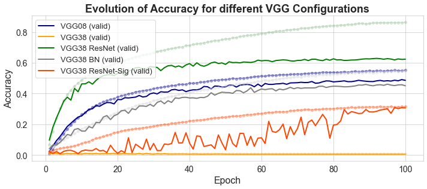
    


    /afs/inf.ed.ac.uk/user/s21/s2118610/miniconda3/envs/mlp/lib/python3.7/site-packages/ipykernel_launcher.py:38: MatplotlibDeprecationWarning: savefig() got unexpected keyword argument "papertype" which is no longer supported as of 3.3 and will become an error two minor releases later
    /afs/inf.ed.ac.uk/user/s21/s2118610/miniconda3/envs/mlp/lib/python3.7/site-packages/ipykernel_launcher.py:38: MatplotlibDeprecationWarning: savefig() got unexpected keyword argument "frameon" which is no longer supported as of 3.3 and will become an error two minor releases later


    
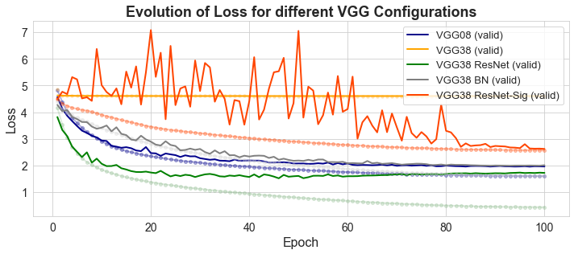
    


    /afs/inf.ed.ac.uk/user/s21/s2118610/miniconda3/envs/mlp/lib/python3.7/site-packages/ipykernel_launcher.py:38: MatplotlibDeprecationWarning: savefig() got unexpected keyword argument "papertype" which is no longer supported as of 3.3 and will become an error two minor releases later
    /afs/inf.ed.ac.uk/user/s21/s2118610/miniconda3/envs/mlp/lib/python3.7/site-packages/ipykernel_launcher.py:38: MatplotlibDeprecationWarning: savefig() got unexpected keyword argument "frameon" which is no longer supported as of 3.3 and will become an error two minor releases later


```python

```

## Experiment Set 1.a -  Testing if solution is consisten for multiple seeds


```python
# Collect Results DataFrames
experiment_dir = '../Remote_Experiments/Seed_Experiments/'
df_result_dict = size_fixer(collect_experiment_dicts(target_dir=experiment_dir), 100)
df_result_dict['VGG_38_ResNet_experiment_seed_0'] = baseline_ResNet 

# Show last results
for experiment in df_result_dict.keys():
    print("\nExperiment:", experiment)
    print(df_result_dict[experiment].tail(1))
```

    Data files: ['VGG_38_ResNet_wd_1e_3_s10', 'VGG_38_ResNet_wd_1e_3_s30']
    
    Experiment: VGG_38_ResNet_wd_1e_3_s10
        train_acc  train_loss  val_acc  val_loss
    99   0.856989    0.461924   0.6176  1.704668
    
    Experiment: VGG_38_ResNet_wd_1e_3_s30
        train_acc  train_loss  val_acc  val_loss
    99   0.848947    0.484249   0.6136  1.731053
    
    Experiment: VGG_38_ResNet_experiment_seed_0
        train_acc  train_loss  val_acc  val_loss
    99   0.862611    0.437051   0.6232  1.724516


## Plotter


```python
def plot_acc_error_evolution(dataset_dict):
    
    # Dataset list
    ds_list = list(dataset_dict.values())
    
    # Get epoch number for x axis
    epoch_n = range(1, len(ds_list[0])+1)

    titles = ['Evolution of Accuracy for different VGG Configurations', 'Evolution of Loss for different VGG Configurations']
    acc_loss = ['acc', 'loss']
    ylabels = ['ACcuracy', 'Loss']
    
    for i in range(len(titles)):
        fig, axes = plt.subplots(figsize = (10,5))

        # Plot lines
        axes.plot( epoch_n, 'train_'+acc_loss[i], data=ds_list[0], marker='.', markerfacecolor='lightblue', markersize=8, color='skyblue', linewidth=3, alpha=0.3, label = '_nolegend_')
        axes.plot( epoch_n, 'val_'+acc_loss[i], data=ds_list[0], marker='', color='dodgerblue', linewidth=3, label = 'VGG ResNet 38 Layers Seed 10 (valid)')
        axes.plot( epoch_n, 'train_'+acc_loss[i], data=ds_list[1], marker='.', markerfacecolor='orange', markersize=8, color='peachpuff', linewidth=3, alpha=0.3, label = '_nolegend_')
        axes.plot( epoch_n, "val_"+acc_loss[i], data=ds_list[1], marker='', color='orange', linewidth=3, label = 'VGG ResNet 38 Layers Seed 30 (valid)')
        axes.plot( epoch_n, 'train_'+acc_loss[i], data=ds_list[2], marker='.', markerfacecolor='darkseagreen', markersize=8, color='darkseagreen', linewidth=3,alpha=0.3,  label = '_nolegend_')
        axes.plot( epoch_n, 'val_'+acc_loss[i], data=ds_list[2], marker='', color='green', linewidth=3, label = 'VGG ResNet 38 Layers Seed 0 (valid)')
        axes.legend(loc='best', prop={'size': 13})
        axes.tick_params(axis='both', which='major', labelsize=12)
        axes.set_ylabel(ylabels[i], fontsize=15)
        axes.set_xlabel('Epoch', fontsize=15)
        axes.set_title(titles[i], fontweight="bold", fontsize=15)
    
        plt.tight_layout()
        plt.show()
        plot_name='exp_set_2'
        fig.savefig('plots/{}_{}_performance.pdf'.format(plot_name, acc_loss[i]), dpi=None, facecolor='w', edgecolor='w',
        orientation='portrait', papertype=None, format='pdf',
        transparent=False, bbox_inches=None, pad_inches=0.1,
        frameon=None, metadata=None)
```


```python
plot_acc_error_evolution(df_result_dict)
```


    
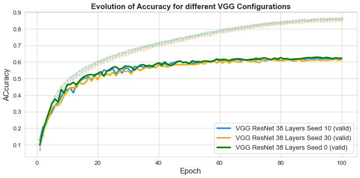
    


    /afs/inf.ed.ac.uk/user/s21/s2118610/miniconda3/envs/mlp/lib/python3.7/site-packages/ipykernel_launcher.py:35: MatplotlibDeprecationWarning: savefig() got unexpected keyword argument "papertype" which is no longer supported as of 3.3 and will become an error two minor releases later
    /afs/inf.ed.ac.uk/user/s21/s2118610/miniconda3/envs/mlp/lib/python3.7/site-packages/ipykernel_launcher.py:35: MatplotlibDeprecationWarning: savefig() got unexpected keyword argument "frameon" which is no longer supported as of 3.3 and will become an error two minor releases later


    
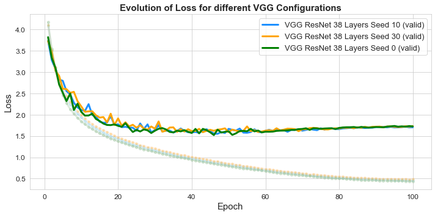
    


    /afs/inf.ed.ac.uk/user/s21/s2118610/miniconda3/envs/mlp/lib/python3.7/site-packages/ipykernel_launcher.py:35: MatplotlibDeprecationWarning: savefig() got unexpected keyword argument "papertype" which is no longer supported as of 3.3 and will become an error two minor releases later
    /afs/inf.ed.ac.uk/user/s21/s2118610/miniconda3/envs/mlp/lib/python3.7/site-packages/ipykernel_launcher.py:35: MatplotlibDeprecationWarning: savefig() got unexpected keyword argument "frameon" which is no longer supported as of 3.3 and will become an error two minor releases later


## Experiment Set 2 -  Testing weight decay coefficients


```python
# Collect Results DataFrames
experiment_dir = '../Remote_Experiments/Experiment_Set_2/'
df_result_dict = size_fixer(collect_experiment_dicts(target_dir=experiment_dir), 100)
df_result_dict['VGG 38 ResNet'] = baseline_ResNet
best_ResNet = df_result_dict['VGG_38_ResNet_wd_1e_3']
# Show last results
for experiment in df_result_dict.keys():
    print("\nExperiment:", experiment)
    print(df_result_dict[experiment].tail(1))
```

    Data files: ['VGG_38_ResNet_wd_1e_4', 'VGG_38_ResNet_wd_1e_3', 'VGG_38_ResNet_wd_1e_2']
    
    Experiment: VGG_38_ResNet_wd_1e_4
        train_acc  train_loss  val_acc  val_loss
    99   0.882316    0.375875   0.6264  1.697324
    
    Experiment: VGG_38_ResNet_wd_1e_3
        train_acc  train_loss  val_acc  val_loss
    99   0.878337    0.419799   0.6532  1.353324
    
    Experiment: VGG_38_ResNet_wd_1e_2
        train_acc  train_loss  val_acc  val_loss
    99   0.580884    1.533413   0.5352  1.688711
    
    Experiment: VGG 38 ResNet
        train_acc  train_loss  val_acc  val_loss
    99   0.862611    0.437051   0.6232  1.724516


## Plotter


```python
def plot_acc_error_evolution(dataset_dict):
    
    # Dataset list
    ds_list = list(dataset_dict.values())
    
    # Get epoch number for x axis
    epoch_n = range(1, len(ds_list[0])+1)

    titles = ['Evolution of Accuracy for VGG38 ResNet with weight decay', 'Evolution of Loss for VGG38 ResNet with weight decay']
    acc_loss = ['acc', 'loss']
    ylabels = ['Accuracy', 'Loss']
    
    for i in range(len(titles)):
        fig, axes = plt.subplots(figsize = (10,4.5))

        # Plot lines
        axes.plot( epoch_n, 'train_'+acc_loss[i], data=ds_list[0], marker='.', markerfacecolor='lightblue', markersize=8, color='skyblue', linewidth=2, alpha=0.3, label = '_nolegend_')
        axes.plot( epoch_n, 'val_'+acc_loss[i], data=ds_list[0], marker='', color='dodgerblue', linewidth=2, label = '$\lambda = $ 1e-4 (valid)')
        axes.plot( epoch_n, 'train_'+acc_loss[i], data=ds_list[1], marker='.', markerfacecolor='orange', markersize=8, color='peachpuff', linewidth=2, alpha=0.3, label = '_nolegend_')
        axes.plot( epoch_n, "val_"+acc_loss[i], data=ds_list[1], marker='', color='orange', linewidth=2, label = '$\lambda = $ 1e-3 (valid)')
        axes.plot( epoch_n, 'train_'+acc_loss[i], data=ds_list[2], marker='.', markerfacecolor='darkseagreen', markersize=8, color='darkseagreen', linewidth=2,alpha=0.3,  label = '_nolegend_')
        axes.plot( epoch_n, 'val_'+acc_loss[i], data=ds_list[2], marker='', color='green', linewidth=2, label = '$\lambda = $ 1e-2 (valid)')
        axes.plot( epoch_n, 'train_'+acc_loss[i], data=ds_list[3], marker='.', markerfacecolor='grey', markersize=8, color='grey', linewidth=2,alpha=0.3,  label = '_nolegend_')
        axes.plot( epoch_n, 'val_'+acc_loss[i], data=ds_list[3], marker='', color='grey', linewidth=2, label = 'VGG 38 ResNet (valid)')

        axes.set_ylabel(ylabels[i], fontsize=16)
        if i == 0:
            axes.set_title('Evolution of Accuracy and Loss for VGG38 ResNet with weight decay', fontweight="bold", fontsize=18)
            axes.tick_params(axis='both', which='major', bottom=False, top=False, labelbottom=False, labelsize=12)
            axes.legend(loc='best', prop={'size': 17})

        if i == 1:
            axes.set_xlabel('Epoch', fontsize=16)
            axes.tick_params(axis='both', which='major',labelsize=14)
        plt.tight_layout()
        plt.show()
        plot_name='exp_set_3'
        fig.savefig('plots/{}_{}_performance.pdf'.format(plot_name, acc_loss[i]), dpi=None, facecolor='w', edgecolor='w',
        orientation='portrait', papertype=None, format='pdf',
        transparent=False, bbox_inches=None, pad_inches=0.1,
        frameon=None, metadata=None)
```


```python
plot_acc_error_evolution(df_result_dict)
```


    
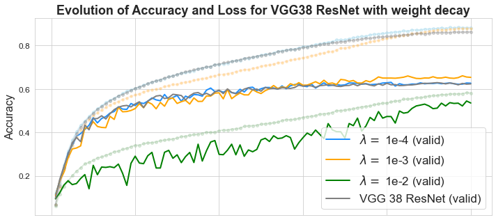
    


    /afs/inf.ed.ac.uk/user/s21/s2118610/miniconda3/envs/mlp/lib/python3.7/site-packages/ipykernel_launcher.py:41: MatplotlibDeprecationWarning: savefig() got unexpected keyword argument "papertype" which is no longer supported as of 3.3 and will become an error two minor releases later
    /afs/inf.ed.ac.uk/user/s21/s2118610/miniconda3/envs/mlp/lib/python3.7/site-packages/ipykernel_launcher.py:41: MatplotlibDeprecationWarning: savefig() got unexpected keyword argument "frameon" which is no longer supported as of 3.3 and will become an error two minor releases later


    
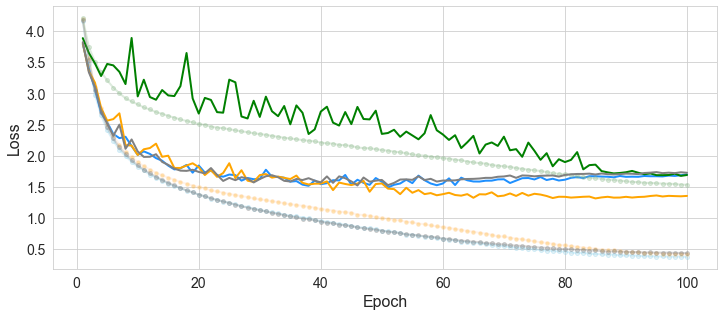
    


    /afs/inf.ed.ac.uk/user/s21/s2118610/miniconda3/envs/mlp/lib/python3.7/site-packages/ipykernel_launcher.py:41: MatplotlibDeprecationWarning: savefig() got unexpected keyword argument "papertype" which is no longer supported as of 3.3 and will become an error two minor releases later
    /afs/inf.ed.ac.uk/user/s21/s2118610/miniconda3/envs/mlp/lib/python3.7/site-packages/ipykernel_launcher.py:41: MatplotlibDeprecationWarning: savefig() got unexpected keyword argument "frameon" which is no longer supported as of 3.3 and will become an error two minor releases later


```python

```

## Experiment Set 3 -  Testing Learning Rate variations


```python
# Collect Results DataFrames
experiment_dir = '../Remote_Experiments/Experiment_Set_3/'
df_result_dict = size_fixer(collect_experiment_dicts(target_dir=experiment_dir), 100)
df_result_dict['VGG 38 ResNet'] = baseline_ResNet
df_result_dict['Bacth 256'] = batch_result_dict['VGG_38_ResNet_bs_256']
df_result_dict['Batch 512'] = batch_result_dict['VGG_38_ResNet_bs_512']
df_result_dict['WP 1e-3'] = best_ResNet

# Show last results
for experiment in df_result_dict.keys():
    print("\nExperiment:", experiment)
    print(df_result_dict[experiment].tail(1))
```

    Data files: ['VGG_38_ResNet_LR_5', 'VGG_38_ResNet_LR_30', 'VGG_38_ResNet_LR_100']
    
    Experiment: VGG_38_ResNet_LR_5
        train_acc  train_loss  val_acc  val_loss
    99   0.600105    1.406288   0.5464  1.634162
    
    Experiment: VGG_38_ResNet_LR_30
        train_acc  train_loss  val_acc  val_loss
    99   0.216358    3.158098   0.2108  3.171369
    
    Experiment: VGG_38_ResNet_LR_100
        train_acc  train_loss  val_acc  val_loss
    99   0.157621    3.512043   0.1572    3.4995
    
    Experiment: VGG 38 ResNet
        train_acc  train_loss  val_acc  val_loss
    99   0.862611    0.437051   0.6232  1.724516
    
    Experiment: Bacth 256
        train_acc  train_loss  val_acc  val_loss
    99   0.889784    0.390893  0.61714  1.510164
    
    Experiment: Batch 512
        train_acc  train_loss   val_acc  val_loss
    99   0.862885    0.483501  0.600145  1.555187
    
    Experiment: WP 1e-3
        train_acc  train_loss  val_acc  val_loss
    99   0.878337    0.419799   0.6532  1.353324


## Plotter


```python
def plot_acc_error_evolution(dataset_dict):
    
    # Dataset list
    ds_list = list(dataset_dict.values())
    
    # Get epoch number for x axis
    epoch_n = range(1, len(ds_list[0])+1)

    titles = ['Evolution of Accuracy for VGG38 RN+WP for different Learning Rates', 'Evolution of Loss for VGG38 RN+WP for different Learning Rates']
    acc_loss = ['acc', 'loss']
    ylabels = ['Accuracy', 'Loss']
    
    for i in range(len(titles)):
        fig, axes = plt.subplots(figsize = (10,5))

        # Plot lines
        axes.plot( epoch_n, 'train_'+acc_loss[i], data=ds_list[0], marker='.', markerfacecolor='lightblue', markersize=8, color='skyblue', linewidth=2, alpha=0.3, label = '_nolegend_')
        axes.plot( epoch_n, 'val_'+acc_loss[i], data=ds_list[0], marker='', color='dodgerblue', linewidth=2, label = 'LR x5 (valid)')
        axes.plot( epoch_n, 'train_'+acc_loss[i], data=ds_list[1], marker='.', markerfacecolor='orange', markersize=8, color='peachpuff', linewidth=2, alpha=0.3, label = '_nolegend_')
        axes.plot( epoch_n, "val_"+acc_loss[i], data=ds_list[1], marker='', color='orange', linewidth=2, label = 'LR x30 (valid)')
        
        axes.plot( epoch_n, 'train_'+acc_loss[i], data=ds_list[3], marker='.', markerfacecolor='orangered', markersize=8, color='orangered', linewidth=2,alpha=0.3,  label = '_nolegend_')
        axes.plot( epoch_n, 'val_'+acc_loss[i], data=ds_list[3], marker='', color='orangered', linewidth=2, label = 'mini-batch size 256 (valid)')
        axes.plot( epoch_n, 'train_'+acc_loss[i], data=ds_list[4], marker='.', markerfacecolor='salmon', markersize=8, color='salmon', linewidth=2,alpha=0.3,  label = '_nolegend_')
        axes.plot( epoch_n, 'val_'+acc_loss[i], data=ds_list[4], marker='', color='salmon', linewidth=2, label = 'mini-batch size 512 (valid)')
        
        axes.plot( epoch_n, 'train_'+acc_loss[i], data=ds_list[5], marker='.', markerfacecolor='darkseagreen', markersize=8, color='darkseagreen', linewidth=2,alpha=0.3,  label = '_nolegend_')
        axes.plot( epoch_n, 'val_'+acc_loss[i], data=ds_list[5], marker='', color='green', linewidth=2, label = 'VGG38 RN+WP (valid)')
        #axes.plot( epoch_n, 'train_'+acc_loss[i], data=ds_list[3], marker='.', markerfacecolor='grey', markersize=8, color='grey', linewidth=2,alpha=0.3,  label = '_nolegend_')
        #axes.plot( epoch_n, 'val_'+acc_loss[i], data=ds_list[3], marker='', color='grey', linewidth=2, label = 'VGG 38 ResNet (valid)')

        axes.legend(loc='best', prop={'size': 16})
        axes.tick_params(axis='both', which='major', labelsize=14)
        axes.set_ylabel(ylabels[i], fontsize=16)
        axes.set_xlabel('Epoch', fontsize=16)
        axes.set_title(titles[i], fontweight="bold", fontsize=18)
    
        plt.tight_layout()
        plt.show()
        plot_name='exp_set_4'
        fig.savefig('plots/{}_{}_performance.pdf'.format(plot_name, acc_loss[i]), dpi=None, facecolor='w', edgecolor='w',
        orientation='portrait', papertype=None, format='pdf',
        transparent=False, bbox_inches=None, pad_inches=0.1,
        frameon=None, metadata=None)
```


```python
plot_acc_error_evolution(df_result_dict)
```


    
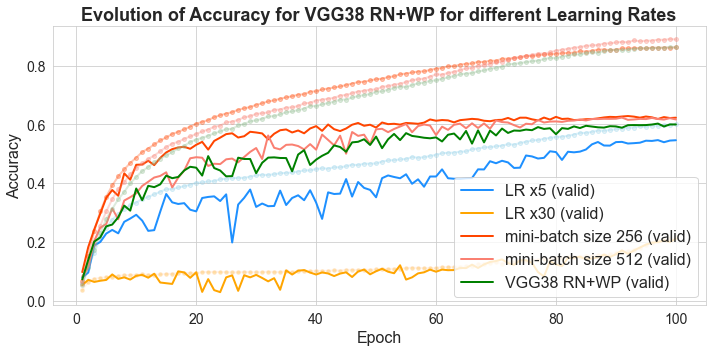
    


    /afs/inf.ed.ac.uk/user/s21/s2118610/miniconda3/envs/mlp/lib/python3.7/site-packages/ipykernel_launcher.py:44: MatplotlibDeprecationWarning: savefig() got unexpected keyword argument "papertype" which is no longer supported as of 3.3 and will become an error two minor releases later
    /afs/inf.ed.ac.uk/user/s21/s2118610/miniconda3/envs/mlp/lib/python3.7/site-packages/ipykernel_launcher.py:44: MatplotlibDeprecationWarning: savefig() got unexpected keyword argument "frameon" which is no longer supported as of 3.3 and will become an error two minor releases later


    
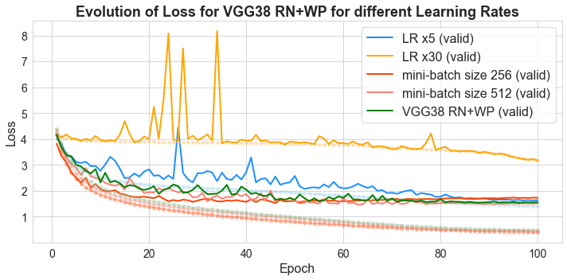
    


    /afs/inf.ed.ac.uk/user/s21/s2118610/miniconda3/envs/mlp/lib/python3.7/site-packages/ipykernel_launcher.py:44: MatplotlibDeprecationWarning: savefig() got unexpected keyword argument "papertype" which is no longer supported as of 3.3 and will become an error two minor releases later
    /afs/inf.ed.ac.uk/user/s21/s2118610/miniconda3/envs/mlp/lib/python3.7/site-packages/ipykernel_launcher.py:44: MatplotlibDeprecationWarning: savefig() got unexpected keyword argument "frameon" which is no longer supported as of 3.3 and will become an error two minor releases later


```python

```

## Experiment Set 4 -  Testing Batch size variations


```python
# Collect Results DataFrames
experiment_dir = '../Remote_Experiments/Experiment_Set_4/'
batch_result_dict = size_fixer(collect_experiment_dicts(target_dir=experiment_dir), 100)
batch_result_dict['VGG 38 ResNet'] = baseline_ResNet
batch_result_dict['WP 1e-3'] = best_ResNet

# Show last results
for experiment in batch_result_dict.keys():
    print("\nExperiment:", experiment)
    print(batch_result_dict[experiment].tail(1))
```

    Data files: ['VGG_38_ResNet_bs_64', 'VGG_38_ResNet_bs_256', 'VGG_38_ResNet_bs_512']
    
    Experiment: VGG_38_ResNet_bs_64
        train_acc  train_loss   val_acc  val_loss
    99   0.833803    0.564995  0.650781  1.286109
    
    Experiment: VGG_38_ResNet_bs_256
        train_acc  train_loss  val_acc  val_loss
    99   0.889784    0.390893  0.61714  1.510164
    
    Experiment: VGG_38_ResNet_bs_512
        train_acc  train_loss   val_acc  val_loss
    99   0.862885    0.483501  0.600145  1.555187
    
    Experiment: VGG 38 ResNet
        train_acc  train_loss  val_acc  val_loss
    99   0.862611    0.437051   0.6232  1.724516
    
    Experiment: WP 1e-3
        train_acc  train_loss  val_acc  val_loss
    99   0.878337    0.419799   0.6532  1.353324


## Plotter


```python
def plot_acc_error_evolution(dataset_dict):
    
    # Dataset list
    ds_list = list(dataset_dict.values())
    
    # Get epoch number for x axis
    epoch_n = range(1, len(ds_list[0])+1)

    titles = ['Evolution of Accuracy for VGG38 ResNet with different min-batch sizes', 'Evolution of Loss for VGG38 ResNet with different min-batch sizes']
    acc_loss = ['acc', 'loss']
    ylabels = ['Accuracy', 'LOss']
    
    for i in range(len(titles)):
        fig, axes = plt.subplots(figsize = (10,5))

        # Plot lines
        axes.plot( epoch_n, 'train_'+acc_loss[i], data=ds_list[0], marker='.', markerfacecolor='lightblue', markersize=8, color='skyblue', linewidth=2, alpha=0.3, label = '_nolegend_')
        axes.plot( epoch_n, 'val_'+acc_loss[i], data=ds_list[0], marker='', color='dodgerblue', linewidth=2, label = 'Batch Size 64 (valid)')
        axes.plot( epoch_n, 'train_'+acc_loss[i], data=ds_list[1], marker='.', markerfacecolor='orange', markersize=8, color='peachpuff', linewidth=2, alpha=0.3, label = '_nolegend_')
        axes.plot( epoch_n, "val_"+acc_loss[i], data=ds_list[1], marker='', color='orange', linewidth=2, label = 'Batch Size 256 (valid)')
        axes.plot( epoch_n, 'train_'+acc_loss[i], data=ds_list[2], marker='.', markerfacecolor='darkseagreen', markersize=8, color='darkseagreen', linewidth=2,alpha=0.3,  label = '_nolegend_')
        axes.plot( epoch_n, 'val_'+acc_loss[i], data=ds_list[2], marker='', color='green', linewidth=2, label = 'Batch Size 512 (valid)')
        axes.plot( epoch_n, 'train_'+acc_loss[i], data=ds_list[4], marker='.', markerfacecolor='grey', markersize=8, color='grey', linewidth=2,alpha=0.3,  label = '_nolegend_')
        axes.plot( epoch_n, 'val_'+acc_loss[i], data=ds_list[4], marker='', color='grey', linewidth=2, label = 'WP 1e-3 (valid)')

        axes.legend(loc='best', prop={'size': 15})
        axes.tick_params(axis='both', which='major', labelsize=12)
        axes.set_ylabel(ylabels[i], fontsize=15)
        axes.set_xlabel('Epoch', fontsize=15)
        axes.set_title(titles[i], fontweight="bold", fontsize=16)
    
        plt.tight_layout()
        plt.show()
        plot_name='exp_set_6'
        fig.savefig('plots/{}_{}_performance.pdf'.format(plot_name, acc_loss[i]), dpi=None, facecolor='w', edgecolor='w',
        orientation='portrait', papertype=None, format='pdf',
        transparent=False, bbox_inches=None, pad_inches=0.1,
        frameon=None, metadata=None)
```


```python
plot_acc_error_evolution(batch_result_dict)
```


    
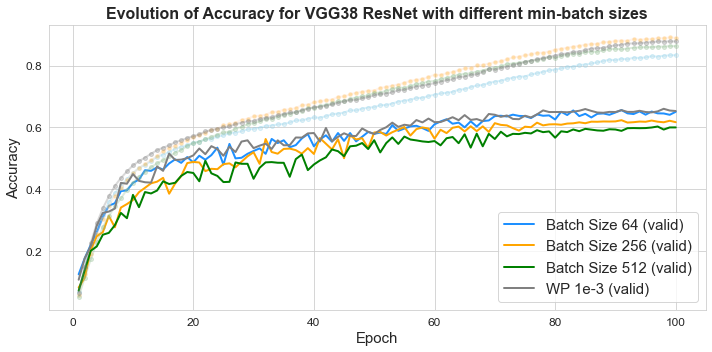
    


    /afs/inf.ed.ac.uk/user/s21/s2118610/miniconda3/envs/mlp/lib/python3.7/site-packages/ipykernel_launcher.py:38: MatplotlibDeprecationWarning: savefig() got unexpected keyword argument "papertype" which is no longer supported as of 3.3 and will become an error two minor releases later
    /afs/inf.ed.ac.uk/user/s21/s2118610/miniconda3/envs/mlp/lib/python3.7/site-packages/ipykernel_launcher.py:38: MatplotlibDeprecationWarning: savefig() got unexpected keyword argument "frameon" which is no longer supported as of 3.3 and will become an error two minor releases later


    
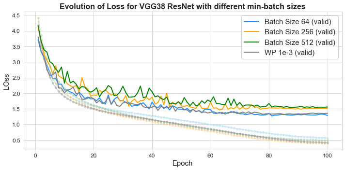
    


    /afs/inf.ed.ac.uk/user/s21/s2118610/miniconda3/envs/mlp/lib/python3.7/site-packages/ipykernel_launcher.py:38: MatplotlibDeprecationWarning: savefig() got unexpected keyword argument "papertype" which is no longer supported as of 3.3 and will become an error two minor releases later
    /afs/inf.ed.ac.uk/user/s21/s2118610/miniconda3/envs/mlp/lib/python3.7/site-packages/ipykernel_launcher.py:38: MatplotlibDeprecationWarning: savefig() got unexpected keyword argument "frameon" which is no longer supported as of 3.3 and will become an error two minor releases later


```python

```

## Experiment Set 5 -  Testing Deeper Models


```python
# Collect Results DataFrames
experiment_dir = '../Remote_Experiments/Experiment_Set_5/'
df_result_dict = size_fixer(collect_experiment_dicts(target_dir=experiment_dir), 100)
df_result_dict['VGG 38 ResNet'] = baseline_ResNet
df_result_dict['WP 1e-3'] = best_ResNet

# Show last results
for experiment in df_result_dict.keys():
    print("\nExperiment:", experiment)
    print(df_result_dict[experiment].tail(1))
```

    Data files: ['VGG_68_ResNet', 'VGG_72_ResNet', 'VGG_106_ResNet']
    
    Experiment: VGG_68_ResNet
        train_acc  train_loss  val_acc  val_loss
    99   0.868589      0.4454   0.6676  1.298147
    
    Experiment: VGG_72_ResNet
        train_acc  train_loss  val_acc  val_loss
    99   0.900211     0.33167   0.6708  1.323875
    
    Experiment: VGG_106_ResNet
        train_acc  train_loss  val_acc  val_loss
    99   0.903474    0.322559   0.6656  1.341619
    
    Experiment: VGG 38 ResNet
        train_acc  train_loss  val_acc  val_loss
    99   0.862611    0.437051   0.6232  1.724516
    
    Experiment: WP 1e-3
        train_acc  train_loss  val_acc  val_loss
    99   0.878337    0.419799   0.6532  1.353324


## Plotter


```python
def plot_acc_error_evolution(dataset_dict):
    
    # Dataset list
    ds_list = list(dataset_dict.values())
    
    # Get epoch number for x axis
    epoch_n = range(1, len(ds_list[0])+1)

    titles = ['Evolution of Accuracy and Loss for VGG38 ResNet for different depths', 'Evolution of Loss for VGG38 ResNet for different depths']
    acc_loss = ['acc', 'loss']
    ylabels = ['Accuracy', 'Error']
    
    for i in range(len(titles)):
        fig, axes = plt.subplots(figsize = (10,5))

        # Plot lines
        axes.plot( epoch_n, 'train_'+acc_loss[i], data=ds_list[0], marker='.', markerfacecolor='lightblue', markersize=8, color='skyblue', linewidth=2, alpha=0.3, label = '_nolegend_')
        axes.plot( epoch_n, 'val_'+acc_loss[i], data=ds_list[0], marker='', color='dodgerblue', linewidth=2, label = 'VGG68 (valid)')
        axes.plot( epoch_n, 'train_'+acc_loss[i], data=ds_list[1], marker='.', markerfacecolor='orange', markersize=8, color='peachpuff', linewidth=2, alpha=0.3, label = '_nolegend_')
        axes.plot( epoch_n, "val_"+acc_loss[i], data=ds_list[1], marker='', color='orange', linewidth=2, label = 'VGG72 (valid)')
        axes.plot( epoch_n, 'train_'+acc_loss[i], data=ds_list[2], marker='.', markerfacecolor='darkseagreen', markersize=8, color='darkseagreen', linewidth=2,alpha=0.3,  label = '_nolegend_')
        axes.plot( epoch_n, 'val_'+acc_loss[i], data=ds_list[2], marker='', color='green', linewidth=2, label = 'VGG106 (valid)')
        axes.plot( epoch_n, 'train_'+acc_loss[i], data=ds_list[4], marker='.', markerfacecolor='grey', markersize=8, color='grey', linewidth=2,alpha=0.3,  label = '_nolegend_')
        axes.plot( epoch_n, 'val_'+acc_loss[i], data=ds_list[4], marker='', color='grey', linewidth=2, label = 'VGG38 RN+WP(valid)')

        axes.set_ylabel(ylabels[i], fontsize=16)
        if i == 0:
            axes.set_title('Evolution of Accuracy and Loss for VGG with multiple depths', fontweight="bold", fontsize=18)
            axes.tick_params(axis='both', which='major', bottom=False, top=False, labelbottom=False, labelsize=12)
            axes.legend(loc='best', prop={'size': 18})

        if i == 1:
            axes.set_xlabel('Epoch', fontsize=16)
            axes.tick_params(axis='both', which='major',labelsize=14)
        plt.tight_layout()
        plt.show()
        plot_name='exp_set_7'
        fig.savefig('plots/{}_{}_performance.pdf'.format(plot_name, acc_loss[i]), dpi=None, facecolor='w', edgecolor='w',
        orientation='portrait', papertype=None, format='pdf',
        transparent=False, bbox_inches=None, pad_inches=0.1,
        frameon=None, metadata=None)
```


```python
plot_acc_error_evolution(df_result_dict)
```


    
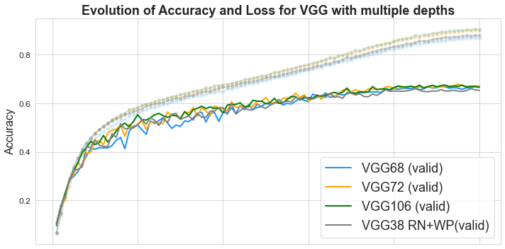
    


    /afs/inf.ed.ac.uk/user/s21/s2118610/miniconda3/envs/mlp/lib/python3.7/site-packages/ipykernel_launcher.py:41: MatplotlibDeprecationWarning: savefig() got unexpected keyword argument "papertype" which is no longer supported as of 3.3 and will become an error two minor releases later
    /afs/inf.ed.ac.uk/user/s21/s2118610/miniconda3/envs/mlp/lib/python3.7/site-packages/ipykernel_launcher.py:41: MatplotlibDeprecationWarning: savefig() got unexpected keyword argument "frameon" which is no longer supported as of 3.3 and will become an error two minor releases later


    
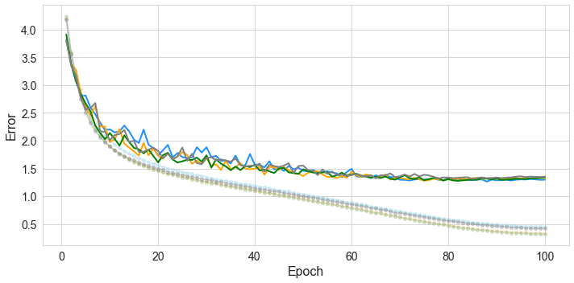
    


    /afs/inf.ed.ac.uk/user/s21/s2118610/miniconda3/envs/mlp/lib/python3.7/site-packages/ipykernel_launcher.py:41: MatplotlibDeprecationWarning: savefig() got unexpected keyword argument "papertype" which is no longer supported as of 3.3 and will become an error two minor releases later
    /afs/inf.ed.ac.uk/user/s21/s2118610/miniconda3/envs/mlp/lib/python3.7/site-packages/ipykernel_launcher.py:41: MatplotlibDeprecationWarning: savefig() got unexpected keyword argument "frameon" which is no longer supported as of 3.3 and will become an error two minor releases later


```python

```
